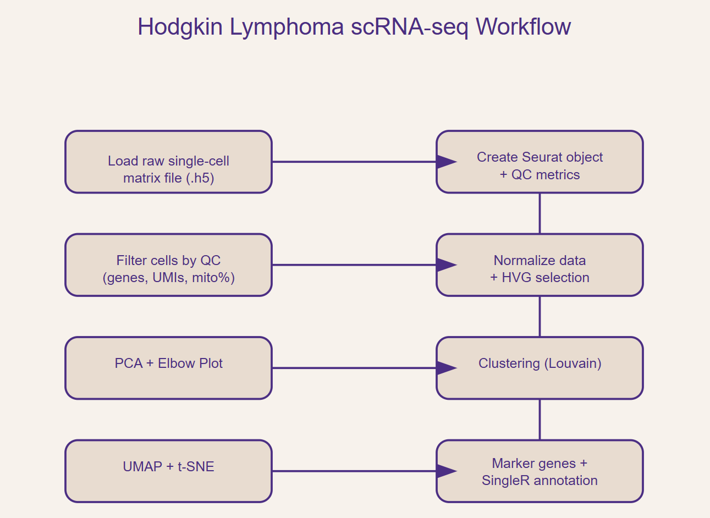

🧵 Project Overview
This analysis processes a 10x Genomics Hodgkin lymphoma dataset using a standard Seurat workflow.
Key goals:

Perform QC and filter low‑quality cells

Normalize and identify highly variable genes

Reduce dimensionality (PCA, UMAP, t‑SNE)

Cluster cells and identify marker genes

Annotate cell types using SingleR with the Human Primary Cell Atlas

This project highlights your ability to work outside Galaxy, handle raw 10x data, and perform manual Seurat analysis — a valuable skill for computational biology roles.

🔬 Dataset
Source: 10x Genomics

Format: raw_feature_bc_matrix.h5

Cells before QC: 1772

Cells after QC: 1738

Genes detected: 5364

🧭 Workflow Diagram
Add your workflow PNG here once generated:

Code

Suggested diagram sections:

Load 10x .h5

Create Seurat object

QC filtering

Normalization + HVG selection

PCA

Clustering

UMAP / t‑SNE

Marker discovery

SingleR annotation

🛠 Methods
1. Load 10x Data
Read .h5 using Read10X_h5

Create Seurat object with min.cells = 3, min.features = 200

2. Quality Control
Compute mitochondrial percentage manually

Visualize QC metrics (boxplots + FeatureScatter)

Filter thresholds:

nFeature_RNA > 200

nFeature_RNA < 1200

percent.mt < 5

3. Normalization & Feature Selection
NormalizeData (LogNormalize)

FindVariableFeatures (2000 HVGs)

Visualize HVGs with VariableFeaturePlot

4. Scaling & PCA
ScaleData on all genes

RunPCA

PCA loadings, heatmaps, elbow plot

5. Clustering
FindNeighbors (dims 1–10)

FindClusters (resolution = 0.5)

Identified 10 clusters

6. Nonlinear Embedding
RunUMAP (dims 1–10)

RunTSNE (dims 1–15)

7. Marker Gene Discovery
FindAllMarkers (only positive markers)

Individual cluster markers (0–9)

FeaturePlots for selected genes (e.g., IL7R, PAX5, ID2)

8. Cell Type Annotation
Reference: HumanPrimaryCellAtlasData()

SingleR with:

label.main

label.fine

Map labels back to Seurat object

Visualize annotated t‑SNE

📊 Key Figures
Add your exported PNGs here:

QC Metrics
Code

PCA
Code

UMAP Clusters
Code

t‑SNE Clusters
Code

SingleR Annotated t‑SNE
Code

Marker Gene FeaturePlots
Code

📁 Results
HL.markers table generated via FindAllMarkers

Individual cluster marker tables (0–9)

SingleR main and fine label assignments

🔄 Reproducibility
Environment
R version: add your version here

Key packages:

Seurat

SingleR

celldex

ggplot2

patchwork

hdf5r

Running the Analysis
Clone the repository

Open scripts/stroma.Rmd

Update the .h5 file path

Knit to HTML or run interactively

📌 Citation
If using HumanPrimaryCellAtlasData:

Mabbott NA, et al. The Human Primary Cell Atlas. 2013.

🧠 Summary
This project demonstrates:

Independent handling of raw 10x Genomics data

Full Seurat workflow proficiency

Automated cell type annotation with SingleR

Clean, reproducible analysis suitable for research or industry pipelines
